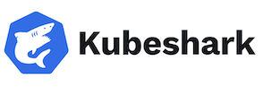
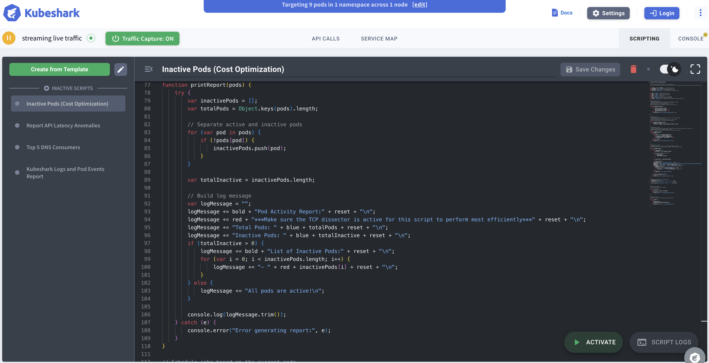

# Übung 8 - Observability

 

**Aufgabe 1 - Deep Network Observability für Kubernetes Cluster mit Kubeshark**

Kubeshark ist ein Tool zur Überwachung und Analyse von Kubernetes-Clustern: [Kubeshark](https://www.kubeshark.co/)  



Sie können es über Homebrew installieren mittels:

   ```bash
brew install kubeshark
   ```
Starten Sie zunächst eines der Kubernetes-Deployments aus Übung 5 (z. B. Aufgabe 3).  

Starten Sie nun Kubeshark mittels

   ```bash
kubeshark tap
   ```

Rufen Sie nun im Browser das Kubeshark-Dashboard auf mittels:

   ```bash
localhost:8899
   ```


Unter dem Punkt "Scripting" können Sie nun ein Template für eine Analyse wählen. Wählen Sie hier z.B. das Template zu "Inactive Pods" und klicken Sie auf "Save new Script". Klicken Sie anschließend auf "Activate" und wechseln Sie dann in die Konsole (Console).  



- Überprüfen Sie, welche Pods in ihrem Cluster aktiv bzw. inaktiv sind.   

- Ermitteln Sie die Top 5 DNS Consumer in ihrem Cluster.

Mit folgendem Befehl können Sie anschließend die Kubeshark-Ressourcen wieder bereinigen:

   ```bash
kubeshark clean
   ```

